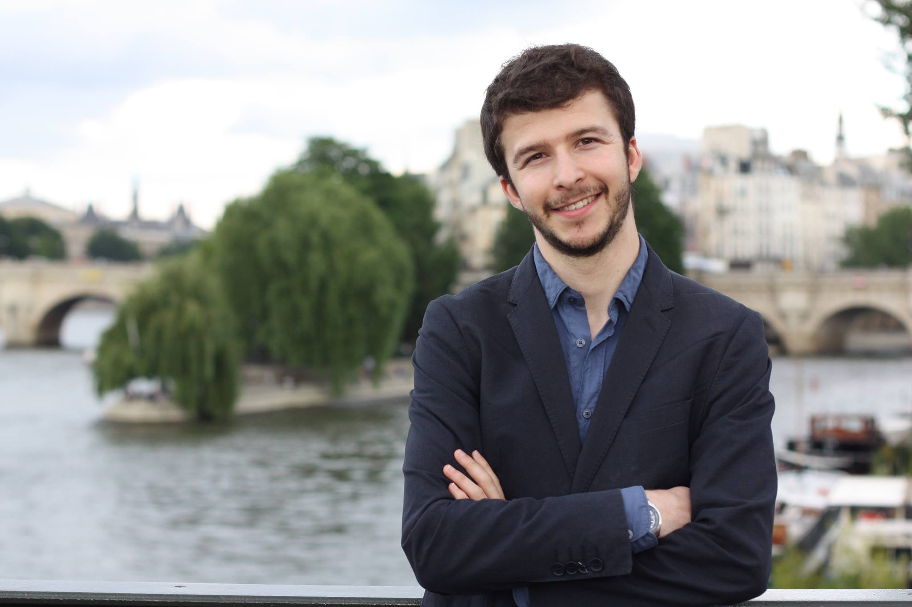

I am a PhD Candidate in Economist at <a href="https://www.sciencespo.fr/department-economics/en.html">Sciences Po</a>, under the supervision of <a href="https://www.gate.cnrs.fr/spip.php?article1024&lang=en/">Pierre-Philippe Combes</a> (University of Lyon and Sciences Po). My research interests are in intergenerational mobility, in particular its measurement, the underlying mechanisms and policies that can remediate intergenerational inequalities.
